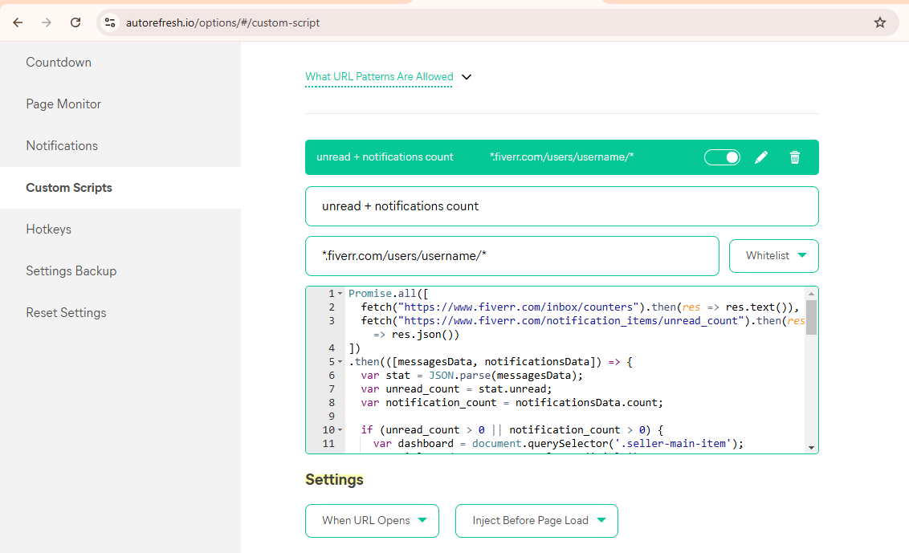
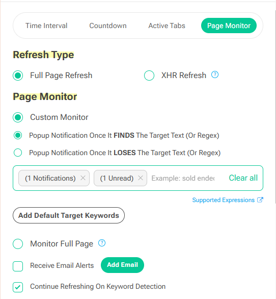

# Fiverr Unread and Notifications Counter Script for Auto Refresh Plus

A JavaScript script that enhances the Fiverr interface by displaying unread messages and notifications count in both the dashboard and browser title.

## Features

- Shows unread message count in red next to the dashboard link
- Displays notification count in orange
- Updates browser tab title with current counts
- Real-time updates using Fiverr's API endpoints

## Usage

### Using with Auto Refresh Plus Extension
1. Install [Auto Refresh Plus](https://chrome.google.com/webstore/detail/auto-refresh-plus/ohfjpkccecpdfkpmfocndhepolhljfhg) from the Chrome Web Store

2. Go to the extension options and navigate to "Custom Scripts" section:
   

3. Add a new script with:
   - Name: Choose any name you prefer for the script
   - URL Pattern: `*fiverr.com/users/username/*`
   

4. Configure the Page Monitor settings:
   - Select "Custom Monitor"
   - Enable "Popup Notification Once It FINDS The Target Text"
   - Add "(1 Notifications)" and "(1 Unread)" as monitoring keywords
   

5. You'll see notifications appear in the Fiverr dashboard when you have new messages or notifications:
   

## How it Works

The script:
1. Fetches unread counts from Fiverr's API endpoints
2. Updates the dashboard text with color-coded counters
3. Modifies the browser tab title to show current counts
4. Handles errors gracefully with console logging

## Requirements

- Active Fiverr session
- Access to Fiverr's dashboard page

## License

MIT